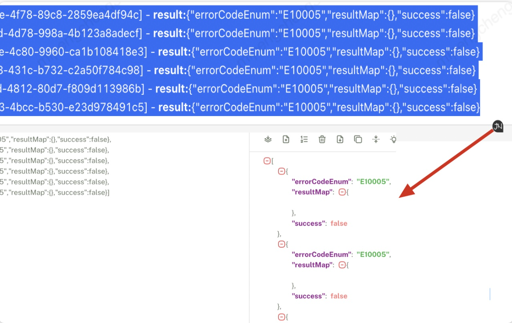

A chrome plugin.Provide useful tools for developers. Like translate timestamp to human readable format, copy json from string, multi search.

Available tools:
- (1)  Translate timestamp to human readable format quickly. 

- (2)  Auto extract json from string to clipboard. 

- (3)  Simple Multi highlight. 

 
 
visit https://chromewebstore.google.com/detail/yumi-tools/giaiccpcickoahjohehdkgfeeobgpiof?hl=zh-CN&utm_source=ext_sidebar for this plugin.